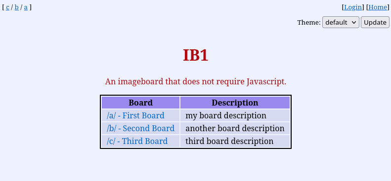
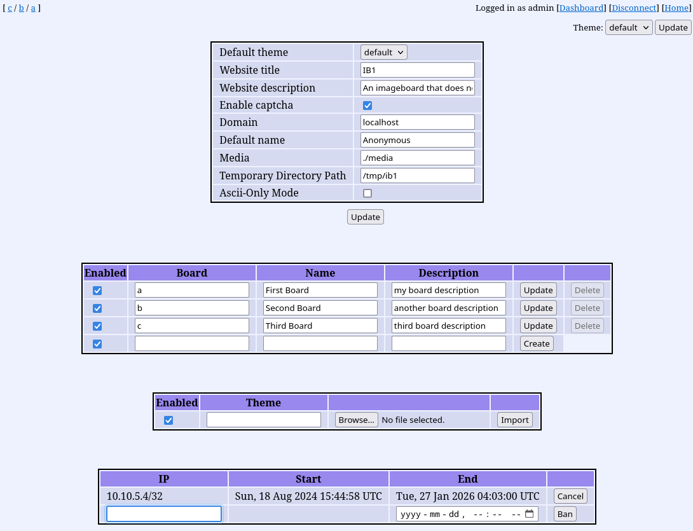

# IB1

An imageboard that does not require Javascript.



## Requirements

* go compiler

### Optionals
* libvips (faster image processing)
* sqlite3 (faster sqlite database)

## Setup

* Build the program.
```
make
# or without make command:
cd src
CGO_ENABLED=0 go build
mv ./IB1 ..
cd ..
```
* Execute the program and enter the admin credentials.
```
./IB1
```
* Open http://localhost:8080/login in a browser and login using the admin credentials.
* Open the dashboard link in the top right corner.
* Add boards and change the configuration as you want.



## Database configuration

The default database configuration is sqlite with the path "./ib1.db".
The database path can be overridden using the environment variable 'IB1_DB_PATH'.
The database type can be overridden using the environment variable 'IB1_DB_TYPE'.

Three database types are available:
* mysql 
* sqlite3
* sqlite (CGO not required)
